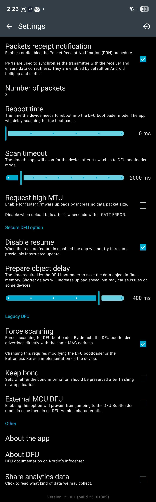

These are the recommended settings for OTAFIX-v1.2 and earlier.  

<table>
<tr>
<td valign="top">

**Packets Receipt Notification:** ON  
**Number of packets:** 8  
**Reboot time:** 0ms  
**Scan timeout:** 2000ms  
**Request high MTU:** OFF  
**Disable resume:** ON  
**Prepare object delay:** 400ms  
**Force Scanning:** ON  
**Keep bond:** OFF  
**External MCU DFU:** OFF

</td>
<td valign="top">

Click the screenshot to view full.

</td>
</tr>
</table>